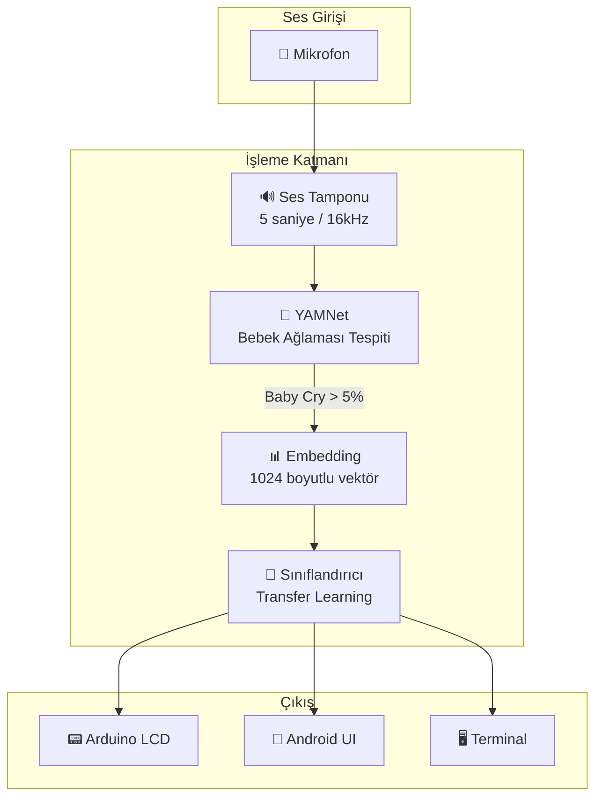

# 🍼 Crytes - Akıllı Bebek Ağlama Analiz Sistemi

<div align="center">


**Yapay zeka destekli bebek ağlama sesi analizi ile ebeveynlere yardımcı olan akıllı sistem.**
* Bu Proje CIONA Teknoloji Takımı tarafından yapılmış ve Advance-Up Hackathon Yarışması 2.lik ödülü kazanmıştır.*
</div>

---

## 📋 İçindekiler

- [Proje Hakkında](#-proje-hakkında)
- [Özellikler](#-özellikler)
- [Sistem Mimarisi](#-sistem-mimarisi)
- [Kurulum](#-kurulum)
- [Kullanım](#-kullanım)
- [Sınıflandırma Kategorileri](#-sınıflandırma-kategorileri)
- [Teknolojiler](#-teknolojiler)
- [Proje Yapısı](#-proje-yapısı)
- [Gereksinimler](#-gereksinimler)
- [Katkıda Bulunanlar](#-katkıda-bulunanlar)

---

## 🎯 Proje Hakkında

**Crytes**, bebeklerin ağlama seslerini gerçek zamanlı olarak analiz ederek **ağlamanın nedenini** tespit eden yapay zeka tabanlı bir sistemdir. 

Sistem iki ana platform üzerinde çalışır:
- **PC Terminal (Python)**: Geliştirme, eğitim ve gelişmiş analiz için
- **Android Uygulaması**: Mobil kullanım için

Ayrıca **Arduino** ile entegrasyon sayesinde sonuçlar **LCD ekranda** gösterilebilir ve **DHT sensörü** ile ortam koşulları (sıcaklık, nem) izlenebilir.

---

## ✨ Özellikler

### 🧠 Yapay Zeka
- **YAMNet Transfer Learning**: Google'ın ses sınıflandırma modelinden özellik çıkarımı
- **5 Farklı Ağlama Nedeni** tespiti
- **%40+ güven eşiği** ile güvenilir tahminler
- **Akıllı oylama sistemi** ile doğruluk artırma (Debouncing)

### 📱 Mobil & Masaüstü
- **Gerçek zamanlı ses analizi** (16kHz, 5 saniyelik pencere)
- **Offline çalışma** - İnternet bağlantısı gerekmez
- **Otomatik sessizlik algılama** (RMS < 0.005)

### 🔌 Donanım Entegrasyonu
- **Arduino + LCD ekran** ile sonuç gösterimi
- **DHT11/DHT22 sensör** ile ortam izleme
- **USB OTG** desteği (Android)

### 👪 Ebeveyn Desteği
- **İnteraktif takip soruları** ile doğrulama
- **Alternatif neden önerileri**
- **Ortam uyarıları** (çok sıcak/soğuk, nem)

---

## 🏗 Sistem Mimarisi



---

## 🚀 Kurulum

### PC Terminal (Python)

#### 1. Gereksinimleri Yükle
```bash
cd Pc_Terminal
pip install tensorflow tensorflow-hub librosa numpy sounddevice soundfile scikit-learn matplotlib pyserial
```

#### 2. Model Eğitimi (İsteğe bağlı)
```bash
# Transfer Learning ile model eğitimi
python train_transfer.py
```

#### 3. Canlı Algılamayı Başlat
```bash
python live_detection.py
```

---

### Android Uygulaması

#### 1. Android Studio'da Aç
- File → Open → `Android` klasörünü seç

#### 2. Gradle Sync
- Android Studio otomatik yapacaktır

#### 3. Build & Run
```bash
# Veya terminalde:
cd Android
./gradlew assembleDebug
```

---

### Arduino Kurulumu

1. DHT11/DHT22 sensörünü bağlayın
2. 16x2 LCD ekranı I2C ile bağlayın
3. Arduino kodunu yükleyin
4. COM portunu `live_detection.py` içinde ayarlayın (varsayılan: `COM9`)

---

## 📖 Kullanım

### PC Terminal

```bash
python live_detection.py
```

1. **Mikrofon seçimi** yapın
2. Sistem **otomatik dinlemeye** başlar
3. Bebek ağlaması algılandığında:
   - Sonuç terminal ve LCD'de gösterilir
   - Ortam koşulları kontrol edilir
   - Ebeveyne takip soruları sorulur

### Android

1. Uygulamayı açın
2. **Mikrofon izni** verin
3. Uygulama otomatik dinlemeye başlar
4. Sonuçlar ekranda gösterilir
5. (İsteğe bağlı) USB OTG ile Arduino bağlayın

---

## 🏷 Sınıflandırma Kategorileri

| Sınıf | Türkçe | Emoji | Açıklama |
|-------|--------|-------|----------|
| `hungry` | Açlık | 🍼 | Bebek aç, beslenme gerekiyor |
| `belly_pain` | Karın Ağrısı | 😣 | Mide/bağırsak rahatsızlığı |
| `burping` | Gaz/Geğirme | 💨 | Gaz sancısı, geğirme ihtiyacı |
| `discomfort` | Rahatsızlık | 😫 | Bez değişimi, pozisyon vb. |
| `tired` | Yorgunluk | 😴 | Uyku ihtiyacı |

### Dataset
- **Toplam:** ~684 ses dosyası
- **Format:** WAV
- **Her sınıfta:** 120-143 örnek

---

## 🛠 Teknolojiler

### Backend / Makine Öğrenimi
| Teknoloji | Versiyon | Kullanım |
|-----------|----------|----------|
| Python | 3.8+ | Ana geliştirme dili |
| TensorFlow | 2.x | Model eğitimi ve çıkarımı |
| TensorFlow Hub | - | YAMNet modeli |
| TensorFlow Lite | - | Mobil model |
| Librosa | - | Ses işleme |
| Scikit-learn | - | Veri ön işleme, encoder |

### Mobil
| Teknoloji | Versiyon | Kullanım |
|-----------|----------|----------|
| Kotlin | 1.9+ | Android geliştirme |
| Android SDK | 34 | Hedef platform |
| Min SDK | 24 (Android 7.0) | Minimum sürüm |
| TFLite | - | On-device inference |

### Donanım
| Bileşen | Açıklama |
|---------|----------|
| Arduino | Mikrodenetleyici |
| LCD 16x2 | Sonuç gösterimi |
| DHT11/DHT22 | Sıcaklık/Nem sensörü |
| USB OTG | Android-Arduino bağlantısı |

---

## 📁 Proje Yapısı

```
HackathonCiona/
│
├── Pc_Terminal/                    # Python/PC uygulaması
│   ├── live_detection.py           # 🎯 Canlı algılama scripti
│   ├── train_model.py              # MFCC tabanlı model eğitimi
│   ├── train_transfer.py           # YAMNet transfer learning
│   ├── test_model.py               # Model test scripti
│   ├── convert_to_tflite.py        # TFLite dönüştürücü
│   │
│   ├── yamnet_transfer_model.h5    # Eğitilmiş model
│   ├── yamnet_encoder.pkl          # Label encoder
│   ├── baby_cry_model.h5           # Alternatif MFCC model
│   ├── label_encoder.pkl           # MFCC label encoder
│   ├── scaler.pkl                  # StandardScaler
│   │
│   ├── dataset/                    # Eğitim verisi
│   │   ├── hungry/
│   │   ├── belly_pain/
│   │   ├── burping/
│   │   ├── discomfort/
│   │   └── tired/
│   │
│   └── live_recordings/            # Kaydedilen sesler
│
├── Android/                        # Android uygulaması
│   ├── app/src/main/
│   │   ├── java/com/ciona/babycry/
│   │   │   ├── MainActivity.kt     # Ana aktivite
│   │   │   ├── audio/
│   │   │   │   └── AudioCapture.kt # Ses yakalama
│   │   │   ├── ml/
│   │   │   │   ├── YamnetProcessor.kt
│   │   │   │   └── CryClassifier.kt
│   │   │   └── serial/
│   │   │       └── ArduinoSerial.kt
│   │   ├── assets/
│   │   │   ├── yamnet.tflite       # YAMNet modeli (~16 MB)
│   │   │   └── cry_classifier.tflite
│   │   └── res/
│   │
│   ├── build.gradle.kts
│   └── settings.gradle.kts
│
└── README.md                       # Bu dosya
```

---

## 📋 Gereksinimler

### Python (PC Terminal)
```
tensorflow>=2.10
tensorflow-hub
librosa
numpy
sounddevice
soundfile
scikit-learn
matplotlib
pyserial
```

### Android
- Android Studio Arctic Fox veya üzeri
- Android SDK 34
- Kotlin 1.9+
- Android cihaz: API 24+ (Android 7.0+)

### Donanım (İsteğe Bağlı)
- Arduino Uno/Nano
- 16x2 LCD (I2C)
- DHT11 veya DHT22 sensör
- USB OTG kablosu (Android için)

---

## ⚙️ Konfigürasyon Parametreleri

| Parametre | Değer | Açıklama |
|-----------|-------|----------|
| `SAMPLE_RATE` | 16000 Hz | YAMNet zorunluluğu |
| `DURATION` | 5 saniye | Analiz penceresi |
| `CONFIDENCE_THRESHOLD` | 40% | Minimum güven eşiği |
| `RMS_THRESHOLD` | 0.005 | Sessizlik eşiği |
| `BABY_CRY_THRESHOLD` | 5% | YAMNet bebek ağlaması eşiği |

---

## 🔧 Sorun Giderme

### "Mikrofon bulunamadı"
- Ses cihazlarınızı kontrol edin
- `sounddevice.query_devices()` ile cihazları listeleyin

### "Model yükleme hatası"
- `train_transfer.py` çalıştırarak modeli eğitin
- `.h5` ve `.pkl` dosyalarının var olduğunu kontrol edin

### Arduino bağlanmıyor
- COM port numarasını kontrol edin
- Baudrate: 9600
- Kablo bağlantısını kontrol edin

---

## 👥 Katkıda Bulunanlar

Bu proje **Hackathon Ciona** için geliştirilmiştir.

---

## 📄 Lisans

Bu proje Hackathon Ciona kapsamında geliştirilmiştir.
Bu uygulama Taha Efe Tuncer - Enes Altunbaş - Recep Saki Karaman tarafından geliştirilmiştir.

---

<div align="center">

**Made with ❤️ for babies and parents**

🍼 Crytes - Bebek Ağlama Analiz Sistemi 🍼

</div>
